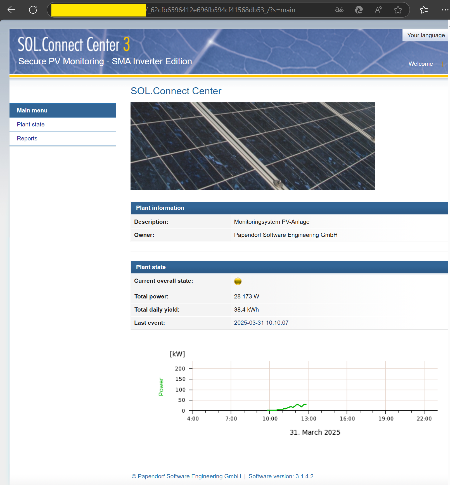
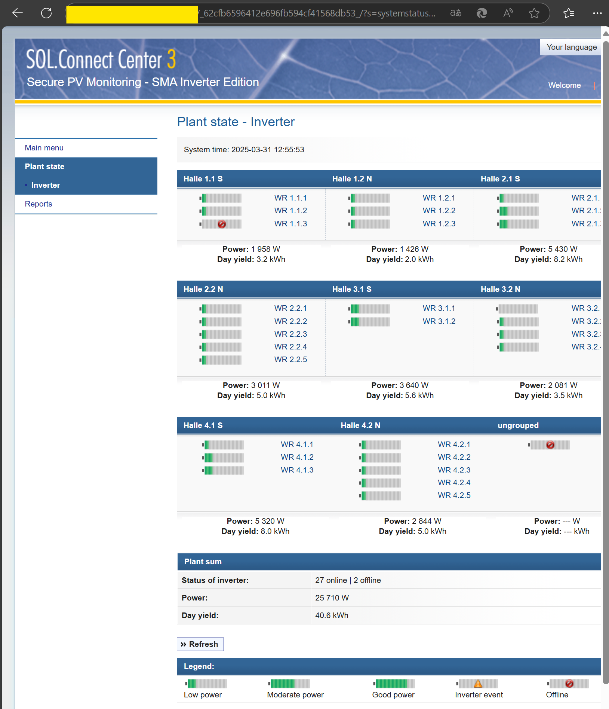
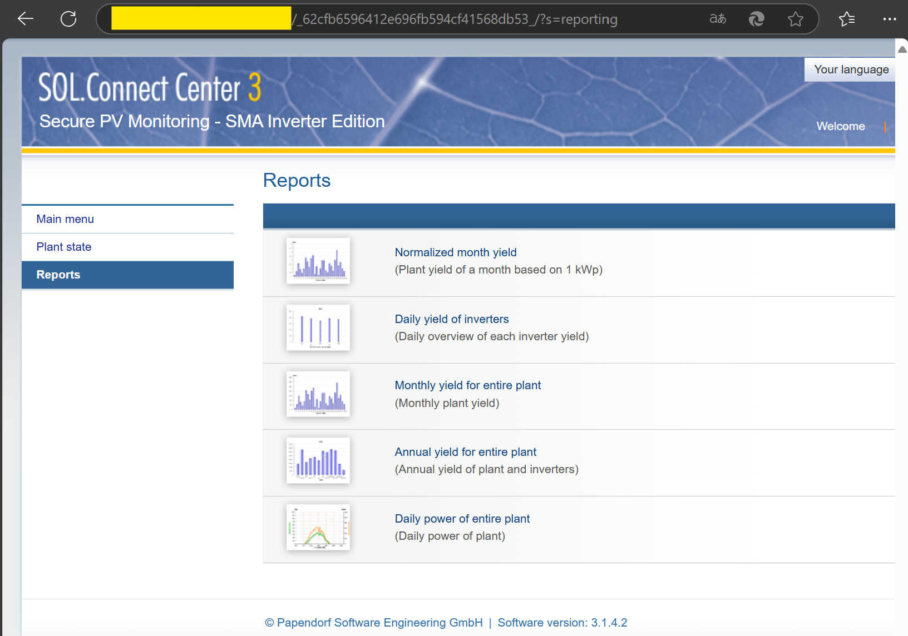
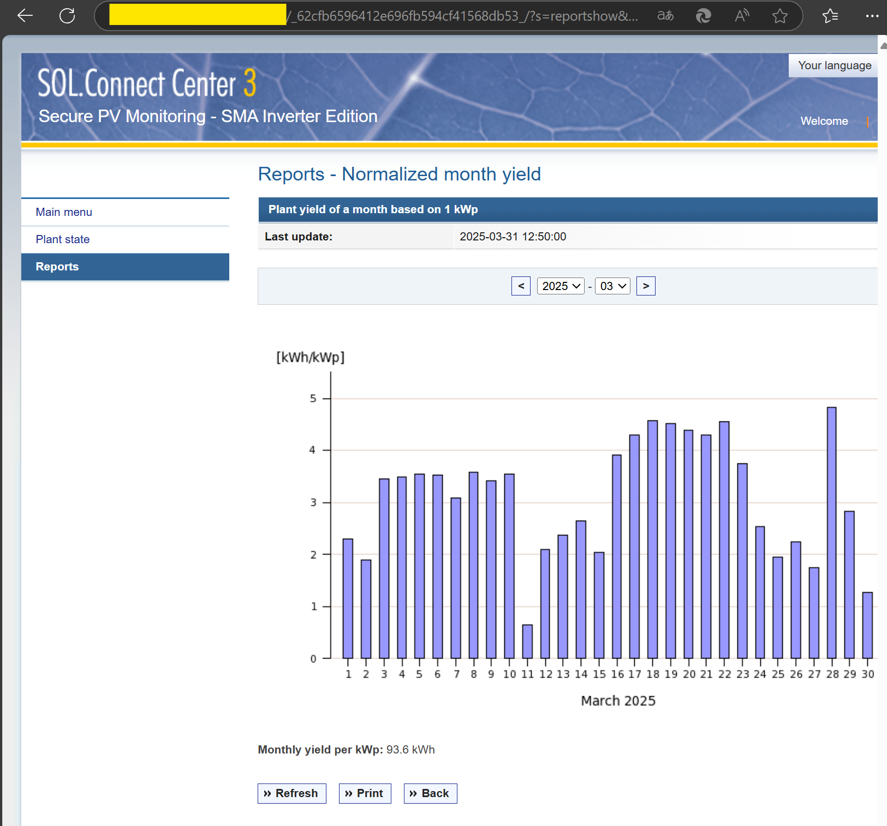

# Vulnerability Description

## CWE-306: Missing Authentication for Critical Function

## Description:

Papendorf Software Engineering GmbH's Secure PV Monitoring System contains multiple web interfaces that fail to enforce proper authentication or authorization mechanisms. This improper access control allows unauthenticated attackers to remotely retrieve sensitive operational data from the photovoltaic (PV) system without requiring valid credentials.

## Affected Products and Versions:

Secure PV Monitoring - PLATINUM Inverter Edition (Software version: 3.3.0.0)
Secure PV Monitoring - Danfoss Solar Inverter Edition (Software version: 1.3.5)
Secure PV Monitoring - SMA Inverter Edition (Software version: 1.3.5)

## Impact:
Exploiting this vulnerability enables attackers to access:

- Real-time and historical power generation data, including granular metrics about the PV system's energy output.

- Real-time operational status of individual inverters, revealing performance parameters, operational modes, and potential fault conditions.

